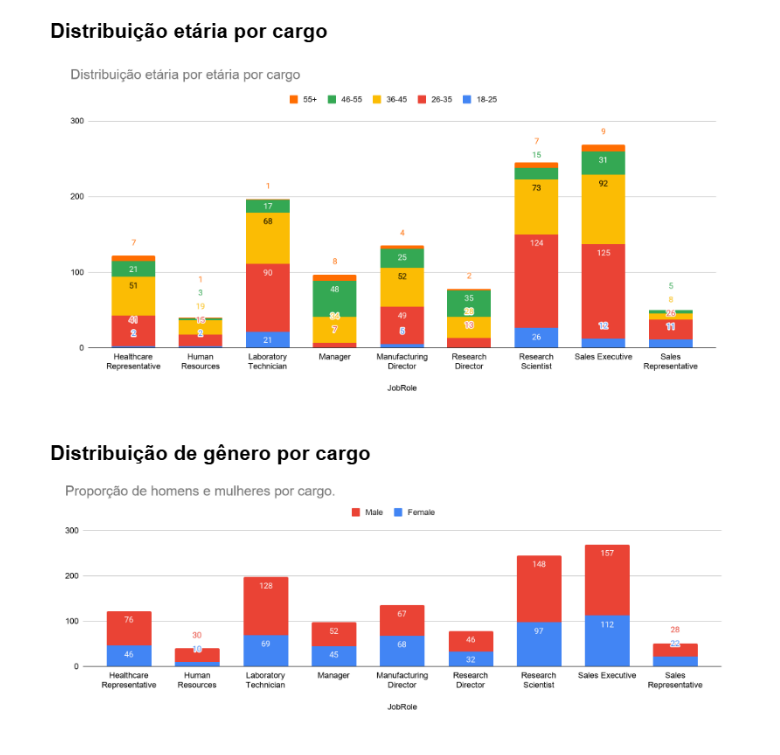
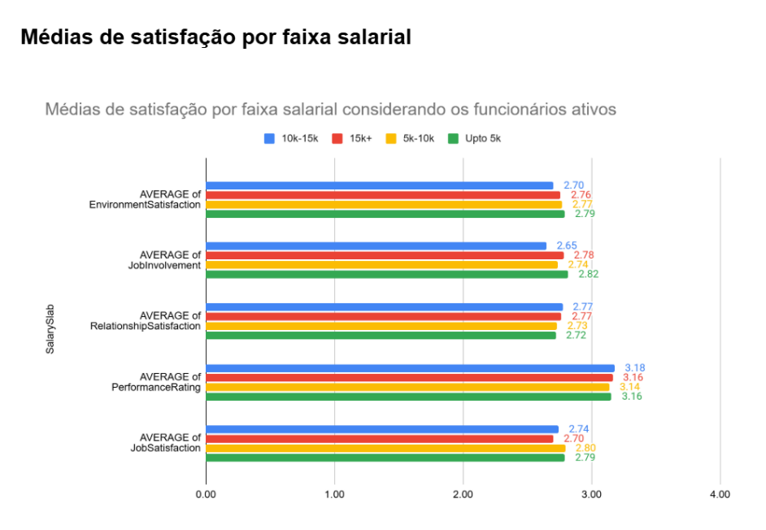
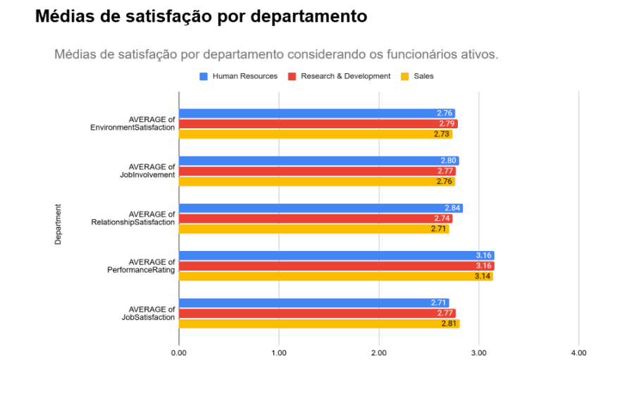
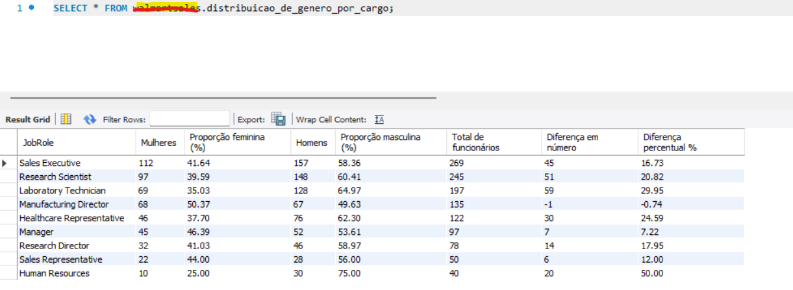

# People Analytics Project

Neste projeto, realizei todas as etapas de um processo **ETL (Extract, Transform, Load)** utilizando um dataset de Recursos Humanos de uma empresa fictícia.  
O objetivo foi construir um panorama abrangente da força de trabalho, oferecendo um verdadeiro raio‑x dos colaboradores.

A análise contempla aspectos como **progressão de carreira**, **faixa salarial**, **perfil profissional** e **nível de satisfação** dos funcionários com a empresa.  
Também foram considerados os **dados dos colaboradores desligados**, permitindo identificar padrões e possíveis fatores relacionados à rotatividade.

---

## 📘 Dicionário dos Dados

| **Atributo**            | **Descrição**                          | **Valores / Intervalo / Medida esperada** |
|--------------------------|----------------------------------------|-------------------------------------------|
| EmpID                    | Identificação única do funcionário     | Número sequencial único                   |
| Age                      | Idade do funcionário                   | Anos                                      |
| AgeGroup                 | Faixa etária categorizada              | 18–25, 26–35, 36–45, 46–55, 55+           |
| Gender                   | Gênero do funcionário                  | Male, Female                              |
| Department               | Departamento de atuação                | Sales, Research & Development, Human Resources |
| EducationalField         | Área de formação acadêmica             | Life Sciences, Medical, Marketing, Technical Degree, Other |
| Attrition                | Indica se o funcionário saiu da empresa| Yes, No                                   |
| EnvironmentSatisfaction  | Satisfação com ambiente de trabalho    | Escala 1 (Baixa) – 4 (Alta)               |
| JobRole                  | Cargo ocupado                          | Sales Executive, Research Scientist, Laboratory Technician, Manager, HR, etc. |
| MonthlyIncome            | Salário mensal                         | Dólar                                     |
| PerformanceRating        | Avaliação de desempenho                | Escala 1 – 4                              |
| YearsAtCompany           | Tempo de empresa                       | Anos                                      |
| JobSatisfaction          | Grau de satisfação com o trabalho      | Escala 1 – 4                              |

---

## ⚙️ Extraction

Os dados foram extraídos do dataset **“HR Analytics Dataset”** disponível no Kaggle, em formato **CSV**, e tratados inicialmente no **Google Sheets**.  
🔗 Acesse o dataset original no Kaggle *([https://drive.google.com/drive/folders/18mQalCEyZypeV8TJeP3SME_R6qsCS2Og])*.

---

## 🔄 Transformation

- Limpeza e padronização dos dados no Google Sheets  
- Ajuste de valores nulos e inconsistências  
- Preparação para integração com Power BI  

---

## 📤 Loading

Os dados tratados foram carregados no **Power BI** para construção de dashboards interativos, permitindo explorar métricas como:

- Distribuição etária e de gênero  
- Estrutura salarial por departamento  
- Níveis de satisfação e desempenho  

---

## 💡 Insights Principais

- Predominância de colaboradores entre **26–35 anos**, com média de idade de **37 anos**  
- Mulheres representam **40,6%** do quadro e têm **salários médios superiores** aos dos homens  
- Tendência salarial **positiva com o tempo de empresa**, indicando valorização da experiência  
- Presença de **colaboradores 55+** em todos os cargos, reforçando a política de inclusão  
- Diferença entre média e mediana salarial revela **assimetria** e concentração de rendimentos em cargos estratégicos

  

  

  

  
  <img src="Imagens/dashboard2.png" alt="Gráfico 4" 

Confira o relatório completo e as visualizações interativas no Power BI:  

